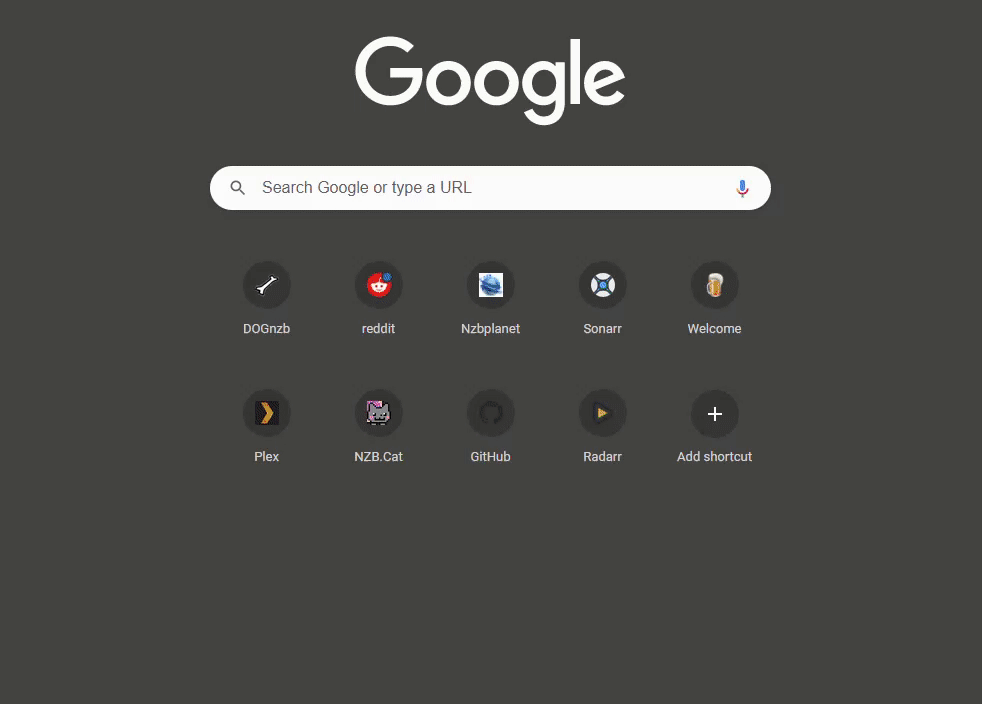
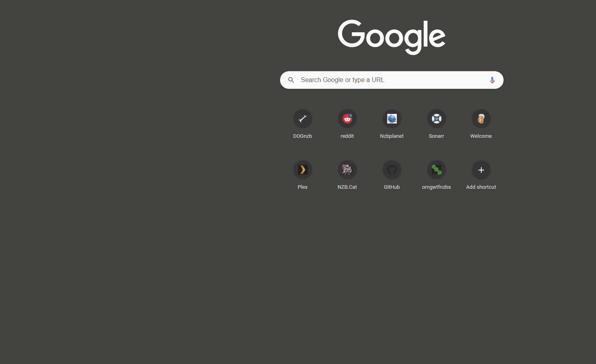

## PURPOSE

> THIS IS A SCALED DOWN VERSION TO TEST ON LESS POWERFUL DEV MACHINE

Collection of docker media centric and VPN apps. If there's anything on here you want to fix or improve feel free to fork and create a PR. If you're changing things, such as removing services from the compose file just because you don't want all of them, please do it in a separate build (clone it twice) if you're also going to submit a PR.

## All

Every service in the compose file expects at least one environment variable. They all require `$DOCKER_DIR` which is where the /config (configuration files will go). This for example is `/home/[user]/docker` and it's not where the /data (media or downloads files live). The one of few exceptions is portainer that puts it's config files under /data.

## Traefik (Revers Proxy)

This is probably the most complicated but the first one that needs to be up working to properly access all your media apps without having to forward each port to your host. There's a great guide [here](https://bit.ly/3qds6Jx) if you want to know more or have a more step-by-step instructions on `traefik`.

### Environment Variables

As it stands, traefik expects these environment variables to be present, docker compose will automatically read a `.env` file that's in the same directory where you run `docker-compose up -d`. I suggest you put the variables there and `chmod 600 .env` to avoid people snooping.

| Name               | Purpose                                                                 |
| ------------------ | ----------------------------------------------------------------------- |
| TZ                 | The local timezone, i.e: America/New_York                               |
| PUID               | The user ID for newly created files (this has no effect at the moment)  |
| PGID               | The group ID for newly created files (this has no effect at the moment) |
| CLOUDFLARE_API_KEY | The Cloudflare API used for DNS Challenge validation                    |
| CLOUDFLARE_EMAIL   | Your cloudflare account email                                           |
| ACME_EMAIL         | The email you want to use to register the certificates                  |
| DOMAIN_NAME        | The domain name to use for i.e: example.com                             |
| DNS_PLUGIN         | The DNS challenge plugin to use (default: cloudflare) full list below   |

[Full list of DNS](https://doc.traefik.io/traefik/https/acme/#providers) plugins supported by traefik. The default (setup here, traefik itself has no default) is cloudflare because it works, it's reliable and it's free.

### Setup

You'll need to update the file `./traefik/middlewares.yml` near the bottom, this section.

```yml
authelia:
  forwardAuth:
    address: 'http://authelia:9091/api/verify?rd=https://authelia.YOURDOMAIN.COM/'
    trustForwardHeader: true
    authResponseHeaders:
      - 'Remote-User'
      - 'Remote-Groups'
```

- Change **YOURDOMAIN.COM** to the domain you chose for and used in the environment variable `DOMAIN_NAME`.
- Create the traefik directory in your DOCKER_DIR like so `mkdir -pv $DOCKER_DIR/traefik/rules` this command will create both the traefik directory and a subdirectory of rules.
- Copy both files under `./traefik` to the rules directory, `cp ./traefik/* $DOCKER_DIR/traefik/rules/`.

The middlewares files have configuration to use OAUTH and MFA with Authelia (covered later), no-auth and basic-auth.

### DNS Challenge for Letsencrypt Certs

I prefer doing a DNS challenge instead of TLS (HTTPS) direct challenge. With TLS challenge, you need to have port forwarding for 443 on your router. This may not always be desirable as you may just want to access your apps internally of via VPN.

### Turn of Certificates

If you don't want to use certificates and would rather just use unencrypted HTTP (not recommended), because you either don't own a domain or don't want the hassle.

Comment remove or change these lines in the traefik service in the `docker-compose.yml` file.

```yml
# REMOVE OR COMMENT OUT
- --certificatesResolvers.letsencrypt.acme.email=${ACME_EMAIL}
- --certificatesResolvers.letsencrypt.acme.storage=/config/acme.json
- --certificatesResolvers.letsencrypt.acme.dnsChallenge.provider=${DNS_PLUGIN}
- --certificatesresolvers.letsencrypt.acme.dnschallenge.delaybeforecheck=0
- --traefik.http.routers.http-catchall.entrypoints=http
- --traefik.http.routers.http-catchall.rule=HostRegexp(`{host:.+}`)
- --traefik.http.middlewares.redirect-to-https.redirectscheme.scheme=https
- --traefik.http.routers.http-catchall.middlewares=redirect-to-https
- --traefik.http.routers.traefik-rtr.tls=true
- --traefik.http.routers.traefik-rtr.tls.certresolver=letsencrypt

# CHANGE FROM
- --traefik.http.routers.traefik-rtr.entrypoints=https
# TO
- --traefik.http.routers.traefik-rtr.entrypoints=http
```

## Authelia MFA with LDAP

Sample workflow, navigate your app, example `https://sonarr.yourdomain.com`, you'll be presented with this login screen.



Once you authenticate, then you can navigate to the rest of the apps easily. The cookies are set to for 1 week, you can extend or shrink that by editing the authelia configuration file.

Navigate to https://radarr.yourdomain.com after authentication.



You can obviously set authentication at the app as well for another level of security.

## Sabnzbd

Requires to edit the `$DOCKER_DIR/sabnzbd/app/sabnzbd.ini` file to whitelist the domain since by default there's no authentication and it's being access via reverse-proxy.

Pick your favorite editor and edit the following line in that file.

```ini
host_whitelist = sabnzbd, <YOURDOMAIN.COM>
```

Access sabnzbd at `https://<yourdomain.com>/sabnzbd`

## NZBGet

The default credentials for nzbget are user: **nzbget** password: **tegbzn6789**

Access nzbget at `https://<yourdomain.com>/nzbget`

## Deluge

Default password is `deluge`

## Qbittorrent

Default username is `admin` and password is `adminadmin`
